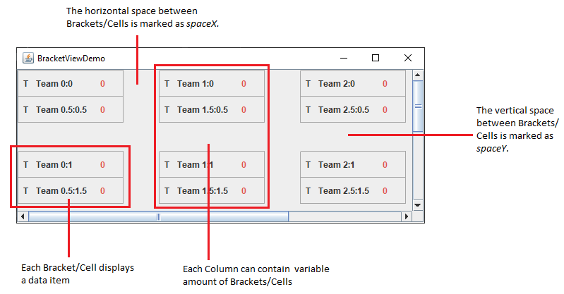
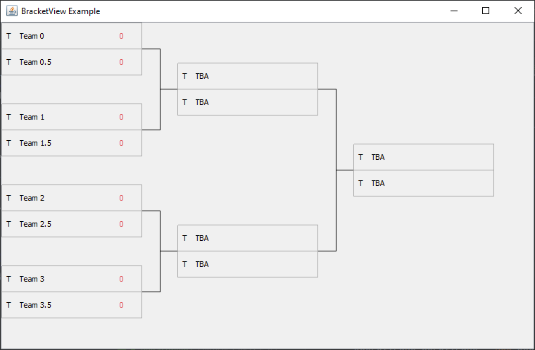

# Proto4j-JBracket

A small and simple Java-Swing component to display tournament brackets in a two-dimensional grid, whereby each column can store a different amount of cells. With the `JBracketView` class you can display tables of data. It does not contain or cache data; it is simply a view of your data. Below is a picture of a typical bracket-view aligned as a grid and as elimination brackets displayed within a scroll pane:

<p align="center">
<kbd>

</kbd>
<kbd>

</kbd>
</p>

The second image shows how a different amount of rows is applied on different columns. The computing of each bracket's position is done by an extra `BracketLocator`. Before creating a new `JBracketView`, you should have a basic understanding of how the component is structured. If you just create a view with a filled model, nothing would be displayed, because you've missed other important components.

## Basic Bracket-View components

### BracketModel

As stated above, the `JBracketView` does not store the data directly, it just displays it. The storage and managing of data is done by a separate `BracketModel`. This model should implement
a variable row size for each column; but if you want to have a static model, the following code could be used to achieve that:

````java
BracketModel<String> model = new BracketModel<>() {
    @Override
    public int getColumnCount() {return 4;}
    
    @Override
    public int getRowCount(int columnIndex) {return 4;}
    
    @Override
    public String getValueAt(int columnIndex, int rowIndex) {
        return "Team " + columnIndex;
    }
    
    @Override
    public void setValueAt(String value, int columnIndex, int rowIndex) {}
};
````

To use the default implementation that provides dynamic rows in each column, just instantiate a new `DefaultBracketModel` object.

### BracketCellRenderer

The `BracketCellRenderer` identifies components that can be used as "rubber stamps" to paint the cells in a `JBracketView`. Therefore, if no cell renderer is configured, no brackets/cells would be painted.

### BracketConstraints

The `BracketConstraints` class specifies constraints either for the `BracketLocator` or `BracketLinePainter` to use when painting the parent `JBracketView`. By now, the following attributes are supported:

* `ipadX`: The initial X-axis space (EmptyBorder.left and right)
* `ipadY`: The initial Y-axis space (EmptyBorder.top and bottom)
* `bracketHeight`: The height for each cell
* `bracketWidth`: The width for each cell
* `spaceX`: The horizontal space between two cells
* `spaceY`: The initial vertical space between two cells
* `lineThickness`: The line width
* `paintMode`: The line drawing strategy

### BracketLinePainter

Classes implementing this interface are used to draw the lines between different brackets. Some default painting implementations are given in the `BracketUtil` class.

You can add the default line painter like this:
````java
JBracketView<String> view = new JBracketView<>();
view.setLinePainter(new DefaultBracketLinePainter());
````

### BracketLocator

Manages the computing of each bracket position in the `JBracketView`
container. There are two computing algorithms implemented, that support elimination-bracket and grid positioning of brackets. 

````java
//Elimination-bracket positioning is used by default. To
// use grid positioning, you have to set the locator:
view.setLocator(BracketLocator.asGrid());
````

## Creating a simple Bracket-View

The bracket view in [BracketViewExample.java](https://github.com/Proto4j/proto4j-jbracket/blob/main/src/test/java/org/proto4j/testing/graph/BracketViewExample.java) uses a custom cell renderer to paint each cell.

````java
// Create the initial games we want to display in the first row.
Game[] games = new Game[4];
//[...]

// Create a new bracket view that automatically inserts our 
// games and creates the needed columns for elimination brackets.
// (true indicates that this view should display an elimination
// tournament view).
JBracketView<Game> view = new JBracketView<>(games, true);
view.setCellRenderer(new GameCellRenderer());
view.setLineRenderer(new DefaultBracketLinePainter());

// Additional attributes of this view can be set via the 
// BracketConstraints object.
BracketConstraints bc = view.getConstraints();
bc.bracketHeight = 75;
bc.bracketWidth = 150;
bc.lineThickness = 1;
bc.spaceY = 40;
bc.spaceX = 50;
bc.paintMode = BracketConstraints.CENTER;
````

Finally, the created view can be added into a scroll pane and displayed in a 
frame:

````java
// Put the view into a JScrollPane
JScrollPane scrollPane = new JScrollPane(view);
JFrame mainFrame = new JFrame("BracketViewDemo");

mainFrame.setContentPane(scrollPane);
mainFrame.pack();
mainFrame.setVisible(true);
````

## Download

Download the [latest JAR file](https://github.com/Proto4j/proto4j-jbracket/releases) from the releases tab. This framework requires a minimum of Java 8+ for developing and running.

## License

    MIT License
    
    Copyright (c) 2023 Proto4j
    
    Permission is hereby granted, free of charge, to any person obtaining a copy
    of this software and associated documentation files (the "Software"), to deal
    in the Software without restriction, including without limitation the rights
    to use, copy, modify, merge, publish, distribute, sublicense, and/or sell
    copies of the Software, and to permit persons to whom the Software is
    furnished to do so, subject to the following conditions:
    
    The above copyright notice and this permission notice shall be included in all
    copies or substantial portions of the Software.
    
    THE SOFTWARE IS PROVIDED "AS IS", WITHOUT WARRANTY OF ANY KIND, EXPRESS OR
    IMPLIED, INCLUDING BUT NOT LIMITED TO THE WARRANTIES OF MERCHANTABILITY,
    FITNESS FOR A PARTICULAR PURPOSE AND NONINFRINGEMENT. IN NO EVENT SHALL THE
    AUTHORS OR COPYRIGHT HOLDERS BE LIABLE FOR ANY CLAIM, DAMAGES OR OTHER
    LIABILITY, WHETHER IN AN ACTION OF CONTRACT, TORT OR OTHERWISE, ARISING FROM,
    OUT OF OR IN CONNECTION WITH THE SOFTWARE OR THE USE OR OTHER DEALINGS IN THE
    SOFTWARE.

